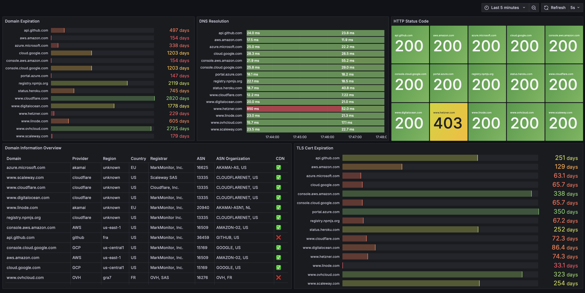

# 🌊 Douro

Web hosting infrastructure analyzer with Prometheus metrics export.

[](https://github.com/aboutmoi/Douro)
[](LICENSE)
[](https://www.python.org/)

**Douro** is a modern tool for analyzing and monitoring website hosting infrastructure. It detects hosting providers, CDNs, and geographic regions via DNS analysis, MTR traceroute, and IP geolocation.

*Perfect for DevOps, monitoring, and infrastructure auditing.*

## ✨ Features

- **DNS Analysis**: DNS resolution (A, AAAA, CNAME, NS) with performance measurement
- **WHOIS Domain**: Registrar, expiration dates
- **WHOIS/RDAP IP**: ASN, organization, country with enhanced detection
- **CDN Detection**: Intelligent CDN detection
- **HTTPS Monitoring**: Status codes, Server headers
- **TLS Certificates**: Certificate expiration dates
- **Prometheus Export**: Metrics for monitoring
- **Health Checks**: Built-in health endpoints
- **Production Ready**: Secure systemd service
- **DevOps Compliant**: Automated deployment scripts

## 🚀 Quick Start

### 1. One-line Installation (2 minutes)
```bash
# Automated installation from GitHub
curl -fsSL https://raw.githubusercontent.com/aboutmoi/Douro/main/scripts/deploy-from-github.sh | bash
```

### 2. Configure sites to monitor
```bash
# Edit configuration
sudo nano /opt/douro/config.production.json

# Add your domains to monitor
{
  "domains": [
    {
      "name": "your-website.com",
      "enabled": true,
      "description": "My website"
    }
  ]
}

# Restart service
sudo systemctl restart douro
```

### 3. View metrics
```bash
# View metrics (after a few minutes)
curl http://localhost:9105/metrics | grep douro_domain

# Or integrate with Prometheus/Grafana
# Metrics endpoint: http://your-server:9105/metrics
```

**✅ That's it! Douro now monitors your sites and exposes metrics.**

## 📦 Manual Installation

### Option 1: Quick deployment script
```bash
git clone https://github.com/aboutmoi/Douro.git
cd Douro
chmod +x scripts/deploy-vm-safe.sh
sudo ./scripts/deploy-vm-safe.sh
```

### Option 2: Step-by-step with Make
```bash
git clone https://github.com/aboutmoi/Douro.git
cd Douro

# Create virtual environment and install dependencies
make install

# Install systemd service (requires sudo)
sudo make service-install

# Deploy to production
make deploy

# Start service
sudo make service-start

# Configuration validation
make check-config
```

## 🔧 Configuration

Douro uses a JSON configuration file to define domains to analyze.

### Quick configuration

**Simple configuration** (`config.simple.json`):
```json
{
  "exporter": {
    "port": 9105,
    "interval_seconds": 300
  },
  "domains": [
    {
      "name": "google.com",
      "enabled": true,
      "description": "Test - Google"
    },
    {
      "name": "github.com", 
      "enabled": true,
      "description": "Test - GitHub"
    }
  ]
}
```

**Production configuration** - See [`config.example.json`](config.example.json) for complete examples.

```bash
# Configuration
sudo nano /opt/douro/config.production.json

# Test configuration
make check-config

# Restart after changes
sudo systemctl restart douro
```

### Service management
```bash
# Service status
sudo systemctl status douro

# View logs
sudo journalctl -u douro -f

# Restart
sudo systemctl restart douro

# Configuration validation
python3 -c "import json; print('Valid' if json.load(open('/opt/douro/config.production.json')) else 'Invalid')"
```

### Prometheus metrics

Metrics are available at: `http://localhost:9105/metrics`

## 📈 Available Metrics

- `douro_domain_info_info` - Complete domain information (provider, region, ASN, etc.)
- `douro_dns_resolution_duration_seconds` - DNS resolution time
- `douro_https_status_code` - HTTPS status codes
- `douro_ssl_certificate_expiry_timestamp` - SSL certificate expiration
- `douro_collection_duration_seconds` - Analysis duration per domain
- `douro_collection_errors_total` - Collection errors

### Metrics examples
```promql
# Hosting providers
douro_domain_info_info{hosting_provider="aws"}

# Hosting regions  
douro_domain_info_info{hosting_region="us-east-1"}

# CDN detection
douro_domain_info_info{cdn="true"}
```

## 📊 Grafana Dashboard

Visualize your domain monitoring with our professional Grafana dashboard. See all your metrics in action:



### 🎯 Dashboard Features

- **Domain Overview Table**: Complete infrastructure view with provider colorization (AWS=Blue, GCP=Green, OVH=Orange)
- **Expiration Monitoring**: Track domain and TLS certificate expiration dates  
- **Performance Metrics**: DNS resolution times and HTTP status codes
- **Geographic Distribution**: Hosting regions and provider analysis
- **CDN Detection**: Visual indicators for CDN usage

### 🚀 Quick Import

1. **Download**: Get the dashboard from [`grafana/DouroDash.json`](grafana/DouroDash.json)
2. **Import**: In Grafana → Create → Import → Paste JSON
3. **Configure**: Update datasource UID to match your Prometheus instance
4. **Enjoy**: Professional monitoring dashboard ready to use!

> 💡 **Pro tip**: The dashboard auto-refreshes every 5 seconds and provides rich tooltips for all metrics.

Detailed setup instructions: [Grafana Setup Guide](grafana/README.md)

## 🔍 Prometheus Configuration

Add to your `prometheus.yml`:
```yaml
scrape_configs:
  - job_name: 'douro'
    static_configs:
      - targets: ['localhost:9105']
    scrape_interval: 300s
```

## 🔄 Advanced usage

### Development environment
```bash
# Clone and setup development
git clone https://github.com/aboutmoi/Douro.git
cd Douro
make dev

# Run tests
make test

# Code linting
make lint

# Manual analysis
python -m douro.douro_analyzer example.com

# Complete deployment
make install-all
```

### Production deployment architecture

```
┌─────────────────┐    ┌─────────────────┐    ┌─────────────────┐
│   Prometheus    │────│     Douro       │────│   Websites      │
│   (scraping)    │    │   (analysis)    │    │   (monitoring)  │
│   :9090         │    │   :9105         │    │                 │
└─────────────────┘    └─────────────────┘    └─────────────────┘
         │                       │                       │
         └─────────────┐         │         ┌─────────────┘
                       │         │         │
                ┌─────────────────┐       │
                │     Grafana     │       │
                │  (visualization)│       │
                │     :3000       │       │
                └─────────────────┘       │
                                          │
                                   ┌─────────────────┐
                                   │   Health        │
                                   │   Checks        │
                                   │   :9106         │
                                   └─────────────────┘
```

### Secure systemd configuration
- ✅ **Dedicated user**: Service runs as `douro` user
- ✅ **Restricted permissions**: Limited filesystem access
- ✅ **Auto-restart**: Service restarts on failure
- ✅ **Resource limits**: Memory and CPU protection
- ✅ **Logging**: Centralized logging via journald

## 🛡️ Security

- **Firewall**: Limit access to metrics ports
- **No root**: Service runs with minimal privileges

## 🔧 Advanced Configuration

```bash
# Edit production configuration
sudo nano /opt/douro/config.production.json

# Validate configuration
make check-config

# View detailed logs
sudo journalctl -u douro -f --since "1 hour ago"
```

### Production configuration example
```json
{
  "exporter": {
    "port": 9105,
    "interval_seconds": 300,
    "timeout_seconds": 30
  },
  "domains": [
    {
      "name": "api.mycompany.com",
      "enabled": true,
      "description": "Production API"
    },
    {
      "name": "www.mycompany.com", 
      "enabled": true,
      "description": "Main website"
    }
  ],
  "monitoring": {
    "log_level": "INFO",
    "enable_verbose_logging": false
  }
}
```

## 📁 Project Structure

```
douro/
├── douro/                   # Main package
│   ├── __init__.py
│   ├── core/                # Core modules
│   │   ├── analyzer.py      # Main analyzer
│   │   ├── metrics.py       # Prometheus metrics
│   │   ├── config.py        # Configuration
│   │   └── region_detector.py # Region detection
│   ├── douro_exporter.py    # Prometheus exporter
│   └── douro_analyzer.py    # CLI analyzer
├── scripts/                 # Deployment scripts
│   ├── deploy-vm-safe.sh    # Secure deployment
│   ├── deploy-from-github.sh # GitHub deployment
│   └── install-service.sh   # Service installation
├── systemd/                 # Systemd configuration
│   └── douro.service
├── configs/                 # Configurations
│   └── logrotate.conf       # Log rotation
└── grafana/                 # Grafana dashboard
    ├── DouroDash.json       # Dashboard configuration
    ├── dourodash.png        # Dashboard screenshot
    └── README.md            # Grafana setup guide
```

## 📚 Documentation

- **[Deployment Guide](DEPLOYMENT.md)** - DevOps deployment guide
- **[Configuration Guide](config.example.json)** - Configuration examples

## 🤝 Contributing

1. Fork the project: https://github.com/aboutmoi/Douro
2. Create a feature branch: `git checkout -b feature/AmazingFeature`
3. Commit changes: `git commit -m 'Add AmazingFeature'`
4. Push to branch: `git push origin feature/AmazingFeature`  
5. Open a Pull Request

## 📄 License

This project is licensed under the MIT License - see the [LICENSE](LICENSE) file for details.

## 🔗 Links

- **GitHub**: https://github.com/aboutmoi/Douro
- **Issues**: https://github.com/aboutmoi/Douro/issues
- **Releases**: https://github.com/aboutmoi/Douro/releases

---

**Made with ❤️ for DevOps and Infrastructure monitoring** 