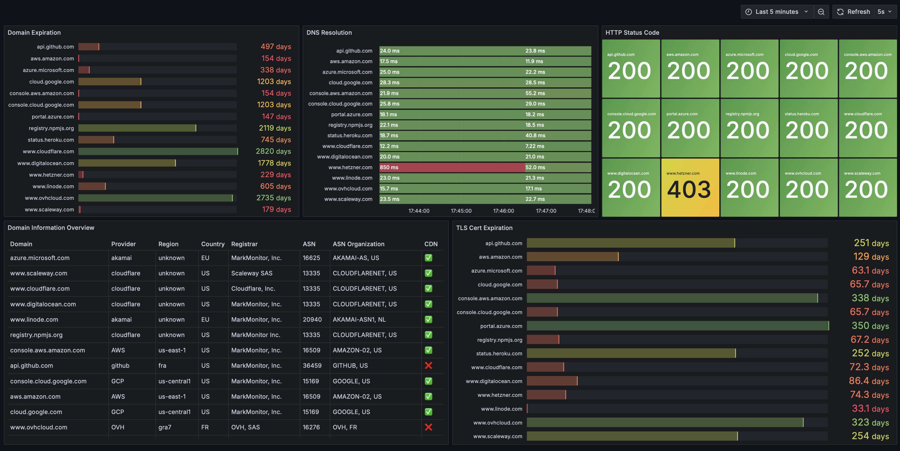

# 📊 Douro Dashboard Grafana

Ce dossier contient les ressources pour le dashboard Grafana de monitoring des domaines avec Douro.

## 📁 Contenu

- `DouroDash.json` - Configuration complète du dashboard Grafana
- `dourodash.png` - Aperçu visuel du dashboard
- `README.md` - Cette documentation

## 🚀 Installation

### 1. Import du dashboard

Dans Grafana :
1. Aller à **+ Create** → **Import**
2. Copier le contenu de `DouroDash.json`
3. Coller dans le champ JSON et cliquer **Load**
4. Vérifier que l'UID de votre datasource Prometheus correspond à `fendcm7udyneoc`

### 2. Configuration requise

- Prometheus configuré avec Douro comme source de données
- Métriques Douro disponibles :
  - `douro_domain_info_info`
  - `douro_domain_expiration_timestamp`
  - `douro_tls_cert_expiration_timestamp`
  - `douro_dns_resolve_duration_seconds`
  - `douro_http_status_code`

## 🎯 Fonctionnalités du dashboard

### **Domain Information Overview** (Tableau principal)
- Colorisation automatique des providers (AWS=Bleu, GCP=Vert, OVH=Orange)
- Icônes CDN (✅ = activé, ❌ = désactivé)
- Tri intelligent sur toutes les colonnes
- Informations complètes : domaine, provider, région, pays, registraire, ASN, CDN

### **Domain Expiration** (Barres horizontales)
- Jours restants avant expiration du domaine
- Couleur dégradée rouge→jaune→vert selon l'urgence

### **DNS Resolution** (Timeline)
- Temps de résolution DNS en millisecondes
- Historique des performances

### **HTTP Status Code** (Stats)
- Codes de statut HTTP avec colorisation
- 200=Vert, 403=Jaune, 404/504=Rouge

### **TLS Cert Expiration** (Barres horizontales)
- Jours restants avant expiration des certificats TLS
- Alerte visuelle pour les certificats proches de l'expiration

## ⚙️ Personnalisation

### Changer l'UID de la datasource
Si votre datasource Prometheus a un UID différent, recherchez et remplacez `fendcm7udyneoc` dans le fichier JSON.

### Modifier les seuils d'alerte
Vous pouvez ajuster les seuils de couleurs dans la section `thresholds` de chaque panel.

### Ajouter des filtres
Modifiez les requêtes PromQL pour filtrer par provider, région, etc. :
```promql
douro_domain_info_info{hosting_provider="ovh"}
```

## 🎨 Aperçu



Le dashboard offre une vue d'ensemble complète de votre infrastructure de domaines avec :
- Répartition géographique et par provider
- Monitoring des expirations
- Suivi des performances
- Détection des problèmes de configuration

## 📈 Métriques exploitées

| Métrique | Description | Usage dans le dashboard |
|----------|-------------|------------------------|
| `douro_domain_info_info` | Métadonnées des domaines | Tableau principal avec toutes les infos |
| `douro_domain_expiration_timestamp` | Timestamp d'expiration domaine | Calcul jours restants |
| `douro_tls_cert_expiration_timestamp` | Timestamp d'expiration TLS | Suivi certificats |
| `douro_dns_resolve_duration_seconds` | Temps résolution DNS | Monitoring performance |
| `douro_http_status_code` | Code réponse HTTP | Détection problèmes |

## 🔧 Dépannage

### Le dashboard ne charge pas
- Vérifiez que Prometheus est accessible
- Confirmez que les métriques Douro sont disponibles
- Validez l'UID de la datasource

### Données manquantes
- Vérifiez que le service Douro fonctionne
- Consultez les logs de Douro pour les erreurs
- Testez les requêtes PromQL directement dans Grafana

### Permissions
- Assurez-vous d'avoir les droits d'import de dashboard
- Vérifiez l'accès en lecture à la datasource Prometheus 